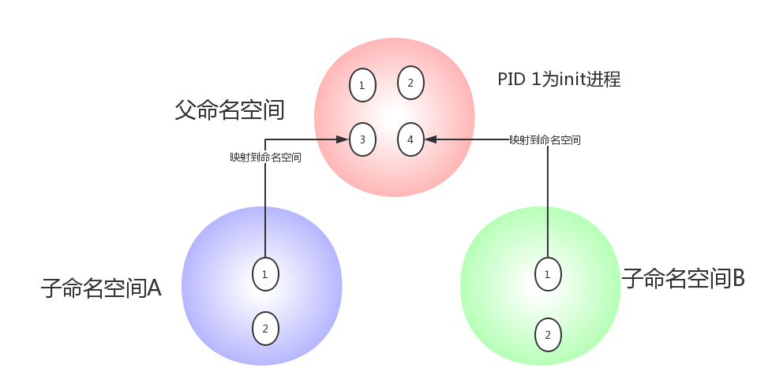

# Linux Namespace 介绍

我们经常听到说Docker 是一个使用了Linux Namespace 和 Cgroups 的虚拟化工具，但是什么是Linux Namespace 它在Docker内是怎么被使用的，说到这里很多人就会迷茫，下面我们就先介绍一下Linux Namespace 以及它们是如何在容器里面使用的。

## 概念

Linux Namespace 是kernel 的一个功能，它可以隔离一系列系统的资源，比如PID(Process ID)，User ID, Network等等。一般看到这里，很多人会想到一个命令`chroot`，就像`chroot`允许进程以 root 身份查看任意一个目录(被隔离开来的)一样，Namesapce也可以在一些资源上，将进程隔离起来，这些资源包括进程树，网络接口，挂载点等等。

比如一家公司向外界出售自己的计算资源。公司有一台性能还不错的服务器，每个用户买到一个tomcat实例用来运行它们自己的应用。有些调皮的客户可能不小心进入了别人的tomcat实例，修改或者关闭了其中的某些资源，这样就会导致各个客户之间互相干扰。也许你会说，我们可以限制不同用户的权限，让用户只能访问自己名下的tomcat，但是有些操作可能需要系统级别的权限，比如root。我们不可能给每个用户都授予root权限，也不可能给每个用户都提供一台全新的物理主机让他们互相隔离，因此这里Linux Namespace就派上了用场。使用Namespace， 我们就可以做到UID级别的隔离，也就是说，我们可以以UID为n的用户，虚拟化出来一个namespace，在这个namespace里面，用户是具有root权限的。但是在真实的物理机器上，他还是那个UID为n的用户，这样就解决了用户之间隔离的问题。当然这个只是Namespace其中一个简单的功能。

除了User Namespace ,PID也是可以被虚拟的。命名空间建立系统的不同视图， 对于每一个命名空间，从用户看起来，应该像一台单独的Linux计算机一样，有自己的init进程(PID为1)，其他进程的PID依次递增，A和B空间都有PID为1的init进程，子容器的进程映射到父容器的进程上，父容器可以知道每一个子容器的运行状态，而子容器与子容器之间是隔离的。从图中我们可以看到，进程3在父命名空间里面PID 为3，但是在子命名空间内，他就是1.也就是说用户从子命名空间 A 内看进程3就像 init 进程一样，以为这个进程是自己的初始化进程，但是从整个 host 来看，他其实只是3号进程虚拟化出来的一个空间而已。

当前Linux一共实现六种不同类型的namespace。

| Namespace类型        | 系统调用参数           | 内核版本 |
| ------------- |:-------------:| -----:|
| Mount namespaces      | CLONE_NEWNS | 2.4.19 |
| UTS namespaces      | CLONE_NEWUTS   |   2.6.19 |
| IPC namespaces | CLONE_NEWIPC    |    2.6.19 |
| PID namespaces | CLONE_NEWPID | 2.6.24 |
| Network namespaces | CLONE_NEWNET |  2.6.29 |
| User namespaces | CLONE_NEWUSER | 3.8 | 

Namesapce 的API主要使用三个系统调用 

- `clone()` - 创建新进程。根据系统调用参数来判断哪种类型的namespace被创建，而且它们的子进程也会被包含到namespace中 
-  `unshare()` - 将进程移出某个namespace
-  `setns()` - 将进程加入到namesp中

## Mount Namespace
mount namespace 是用来隔离各个进程看到的挂载点视图。在不同namespace中的进程看到的文件系统层次是不一样的。在mount namespace 中调用`mount()`和`umount()`仅仅只会影响当前namespace内的文件系统，而对全局的文件系统是没有影响的。

看到这里，也许就会想到`chroot()`。它也是将某一个子目录变成根节点。但是mount namespace不仅能实现这个功能，而且能以更加灵活和安全的方式实现。

mount namespace是Linux 第一个实现的namesapce 类型，因此它的系统调用参数是NEWNS(new namespace 的缩写)。貌似当时人们没有意识到，以后还会有很多类型的namespace加入Linux大家庭。

