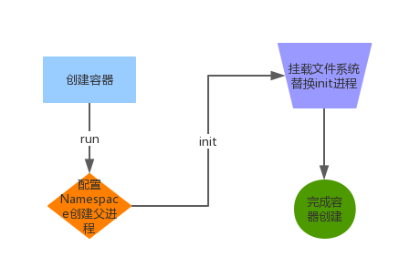

# 构造简单容器
本章我们即将开始真正踏上构造自己的容器道路上。我们会基于当前的操作系统创建一个与宿主机隔离的容器环境，并且配置上基本的文件系统与网络。最后会在容器内运行一些应用来使用我们的容器，是不是很激动，下面我们开始吧。

## Linux proc 文件系统介绍
在开始之前，我们还是需要稍微补充一些基本知识，如果你已经对于这些基本知识很熟悉，请直接略过。Linux 下的/proc 文件系统是由内核提供，它其实不是一个真正的文件系统，只包含了系统运行时信息（比如系统内存，mount 设备信息，一些硬件配置等等，它只存在于内存中，而不占用外存空间。它是以文件系统的形式为访问内核数据的操作提供接口。实际上，很多系统工具都是简单去读取这个文件系统的某个文件内容，比如`lsmod ` 其实就是 `cat /proc/modules`。

当你去遍历这个目录的时候会发现很多数字，这些都是为每个进程创建的空间，数字就是他们的 PID。

	:~# ls /proc/
	1      1216   1320   154  20006  22     27462  32     37   44   51  60   78   868  acpi       devices      interrupts  keys           meminfo       sched_debug  sys            version_signature
	10     12180  1336   155  20007  23     27478  32025  38   45   52  61   780  896  buddyinfo  diskstats    iomem       kmsg           misc          schedstat    sysrq-trigger  vmallocinfo
	100    12192  13567  16   20008  24     28     33     387  47   53  62   8    9    bus        dma          ioports     kpagecount     modules       scsi         sysvipc        vmstat
	10684  12728  14     17   20011  25     29     337    39   48   54  63   818  944  cgroups    driver       ipmi        kpageflags     mounts        self         timer_list     xen
	10698  1279   145    18   20012  26     3      34     40   49   55  7    859  954  cmdline    execdomains  irq         latency_stats  mtrr          slabinfo     timer_stats    zoneinfo
	11     13     15     19   20013  27     30     343    41   5    57  715  861  961  consoles   fb    	       kallsyms    loadavg        net           softirqs     tty
	1170   1301   1505   2    20042  27396  31     35     42   50   58  75   864  99   cpuinfo    filesystems  kcore       locks          pagetypeinfo  stat         uptime
	12     13131  1508   20   21     27443  31809  36     43   501  59  77   865  991  crypto     fs           key-users   mdstat         partitions    swaps        version
	
下面介绍几个比较重要的部分

	/proc/N 					pid为N的进程信息
	/proc/N/cmdline 			进程启动命令
	/proc/N/cwd 				链接到进程当前工作目录
	/proc/N/environ			    进程环境变量列表
	/proc/N/exe 				链接到进程的执行命令文件
	/proc/N/fd 				    包含进程相关的所有的文件描述符
	/proc/N/maps 				与进程相关的内存映射信息
	/proc/N/mem 				指代进程持有的内存，不可读
	/proc/N/root 				链接到进程的根目录
	/proc/N/stat 				进程的状态
	/proc/N/statm 			    进程使用的内存的状态
	/proc/N/status 			    进程状态信息，比stat/statm更具可读性
	/proc/self 				    链接到当前正在运行的进程
	
## 实现 run 命令
 
我们先会实现一个简单版本的 run 命令，类似 `docker run -ti [command]`。然后在后面的章节逐步添加network, mount filesystem 等功能。为了方便了解 docker 启动容器的原理，我们实现的简单版本是参考 runc 的实现。

目前的代码文件结构如下。

	mydocker
	    ├── container
	    │   ├── container_process.go
	    │   └── init.go
	    ├── Godeps
	    │   ├── Godeps.json
	    │   └── Readme
	    ├── main_command.go
	    ├── main.go
	    ├── mydocker
	    ├── run.go
	    └── vendor

首先来看一下入口main文件

	package main
	
	import (
		log "github.com/Sirupsen/logrus"
		"github.com/urfave/cli"
		"os"
	)
	
	const usage = `mydocker is a simple container runtime implementation.
				   The purpose of this project is to learn how docker works and how to write a docker by ourselves
				   Enjoy it, just for fun.`
	
	func main() {
		app := cli.NewApp()
		app.Name = "mydocker"
		app.Usage = usage
	
		app.Commands = []cli.Command{
			initCommand,
			runCommand,
		}
	
		app.Before = func(context *cli.Context) error {
			// Log as JSON instead of the default ASCII formatter.
			log.SetFormatter(&log.JSONFormatter{})
	
			log.SetOutput(os.Stdout)
			return nil
		}
	
		if err := app.Run(os.Args); err != nil {
			log.Fatal(err)
		}
	}

使用`github.com/urfave/cli` 提供的命令行工具， 我们定义了mydocker 的几个基本的命令，包括`runCommand`, `initCommand` ，然后在`app.Before` 内初始化了一下`logrus`的日志配置。
下面我们来看一下子命令的具体定义.
	
	//这里定义了 runCommand的Flags，类似于我们运行命令的时候--指定的参数
	var runCommand = cli.Command{
		Name:  "run",
		Usage: `Create a container with namespace and cgroups limit
				mydocker run -ti [command]`,
		Flags: []cli.Flag{
			cli.BoolFlag{
				Name:        "ti",
				Usage:       "enable tty",
			},
		},
		/*
		这里是run命令执行的真正函数。
		1. 判断参数是否包含command
		2. 获取用户指定的command
		3. 调用Run function 去准备启动容器
 		*/
		Action: func(context *cli.Context) error {
			if len(context.Args()) < 1 {
				return fmt.Errorf("Missing container command")
			}
			cmd := context.Args().Get(0)
			tty := context.Bool("ti")
			Run(tty, cmd)
			return nil
		},
	}
	
	//这里定义了initCommand的具体操作，此操作为内部方法，禁止外部调用
	var initCommand = cli.Command{
		Name:	"init",
		Usage:	"Init container process run user's process in container. Do not call it outside",
		/*
		1. 获取传递过来的command参数
		2. 执行容器初始化操作
		*/
		Action:	func(context *cli.Context) error {
			log.Infof("init come on")
			cmd := context.Args().Get(0)
			log.Infof("command %s", cmd)
			err := container.RunContainerInitProcess(cmd, nil)
			return err
		},
	}

我们先来看一下run 函数干了一些什么。
	
	/*
	这里是父进程也就是我们当前进程执行的内容，根据我们上一章介绍的内容，应该比较容易明白
	1.这里的/proc/self/exe 调用，其中/proc/self指的是当前运行进程自己的环境，exec其实就是自己调用了自己，我们使用这种方式实现对创建出来的进程进行初始化
	2.后面args是参数，其中 init 是传递给本进程的第一个参数，这在本例子中，其实就是会去调用我们的initCommand去初始化进程的一些环境和资源
	3. 下面的clone 参数就是去 fork 出来的一个新进程，并且使用了namespace隔离新创建的进程和外部的环境。
	4. 如果用户指定了-ti 参数，我们就需要把当前进程的输入输出导入到标准输入输出上
	*/
	func NewParentProcess(tty bool, command string) *exec.Cmd {
		args := []string{"init", command}
		cmd := exec.Command("/proc/self/exe", args...)
	    cmd.SysProcAttr = &syscall.SysProcAttr{
	        Cloneflags: syscall.CLONE_NEWUTS | syscall.CLONE_NEWPID | syscall.CLONE_NEWNS |
			syscall.CLONE_NEWNET | syscall.CLONE_NEWIPC,
	    }
		if tty {
			cmd.Stdin = os.Stdin
			cmd.Stdout = os.Stdout
			cmd.Stderr = os.Stderr
		}
		return cmd
	}
	
	/*
	这里的Start方法是真正开始前面创建好的command的调用，他会首先 clone
	出来一个 namespace 隔离的进程，然后在子进程中，调用/proc/self/exe 也就是自己，发送 init 参数，调用我们写的init方法，去初始化容器的一些资源
	*/
	func Run(tty bool, command string) {
		parent := container.NewParentProcess(tty, command)
		if err := parent.Start(); err != nil {
			log.Error(err)
		}
		parent.Wait()
		os.Exit(-1)
	}
	
那么 Init 函数里面干了啥呢

	/*
	这里的init函数执行是在容器内部的，也就是说，代码执行到这里后，其实容器所在的进程已经创建出来了，我们是本容器执行的第一个进程。
	1.使用mount 先去挂载proc 文件系统，方便我们通过ps等系统命令去查看当前进程资源情况
	*/
	func RunContainerInitProcess(command string, args []string) error {
		logrus.Infof("command %s", command)
	
		defaultMountFlags := syscall.MS_NOEXEC | syscall.MS_NOSUID | syscall.MS_NODEV
		syscall.Mount("proc", "/proc", "proc", uintptr(defaultMountFlags), "")
		argv := []string{command}
		if err := syscall.Exec(command, argv, os.Environ()); err != nil {
			logrus.Errorf(err.Error())
		}
		return nil
	}

这里的`MountFlag`的意思如下

- MS_NOEXEC  在本文件系统中不允许运行其他程序
- MS_NOSUID	在本系统中运行程序的时候不允许`set-user-ID`或者`set-group-ID`
- MS_NODEV	这个参数是自从Linux 2.4以来所有 mount 的系统都会默认设定的参数

本函数的最后一句话`syscall.Exec`是最为重要的一句黑魔法，正是这个系统调用实现了将我们初始化动作完成并且运行起来用户的进程这个操作。你可以能会问，这有什么神奇的，不就是运行一下程序嘛，这里我们来解释一下这句话的神奇之处。

首先我们使用 docker 创建起来一个容器之后，会发现容器内的第一个程序也就是 PID 为1的那个进程是我们指定的前台进程。那么根据我们前面讲的过程发现，我们的容器创建之后，执行的第一个进程并不是用户的进程，而是我们的 init 初始化进程，那么这时候如果通过`ps`命令查看就会发现容器内第一个进程变成了我们自己的init，这个是预想的是不一样的。那么你可能会想，大不了我把第一个进程给kill了.这里又有一个头疼的问题，PID 为1的进程是不能 kill 的，如果你给 kill了，那么我们的容器也就推出了，那么有什么办法呢，这里的`execve `系统调用就大显神威了。

我们使用的`syscall.Exec`这个方法其实最终调用了kernel的
`int execve(const char *filename, char *const argv[],
char *const envp[]);`
这个系统函数。他的作用是执行当前filename对应的程序。它会覆盖当前进程镜像，当前进程的数据，堆栈等信息包括 PID 都会被我们将要运行的进程给覆盖。也就是说，我们调用这个方法，将用户指定的进程运行起来，把最初的 init 进程给替换掉，这样当我们进入到容器内部的时候，就会发现容器内的第一个程序就是我们指定的进程了。这其实也是目前docker使用的容器引擎`runc`的实现方式之一。

好，代码差不多讲完了，下面我们来编译运行一下。
	
	#使用go build .在mydocker 目录下进行编译
	root@ubuntu:[mydocker]# go build .
	#我们使用./mydocker run -ti sh命名，其中-ti表示我们想要以交互式运行容器，/bin/sh为我们指定的容器内运行的第一个进程
	root@ubuntu:[mydocker]# ./mydocker run -ti /bin/sh
	{"level":"info","msg":"init come on","time":"2016-11-27T06:15:44Z"}
	{"level":"info","msg":"command /bin/sh","time":"2016-11-27T06:15:44Z"}
	# ps -ef
	UID        PID  PPID  C STIME TTY          TIME CMD
	root         1     0  0 06:15 pts/0    00:00:00 /bin/sh
	root         4     1  0 06:16 pts/0    00:00:00 ps -ef

我们在容器运行`ps -ef`可以发现`/bin/sh`进程是容器内的第一个进程，PID 为1，我们的ps -ef是PID为1的父进程创建出来的。我们对比一下 docker 运行的容器的效果 

	root@iZ254rt8xf1Z:~# docker run -ti ubuntu /bin/sh
	# ps -ef
	UID        PID  PPID  C STIME TTY          TIME CMD
	root         1     0  1 06:25 ?        00:00:00 /bin/sh
	root         5     1  0 06:25 ?        00:00:00 ps -ef
	
是不是有些类似。这里的/bin/sh是一个会在前台一直跑着的进程，那么我们试试如果指定一个运行完就会退出的进程会是什么效果呢。

	root@ubuntu:[mydocker]# ./mydocker run -ti /bin/ls
	{"level":"info","msg":"init come on","time":"2016-11-27T06:28:31Z"}
	{"level":"info","msg":"command /bin/ls","time":"2016-11-27T06:28:31Z"}
	container  Godeps  main_command.go  main.go  mydocker  run.go  vendor
	
由于我们没有`chroot`，所以目前我们的系统文件系统是继承自我们的父进程的，这里我们运行了一下`ls`命令，发现容器启动起来以后，打印出来了当前目录的内容，然后退出了，这个和`docker`要求容器必须有一个一直在前台跑着的进程的要求一致。

##小结
本节我们构造了一个简单的容器，具有基本的namesapce隔离，并且确定了我们的基本开发架构。基本创建流程如下

下面我们会继续完善这个容器。